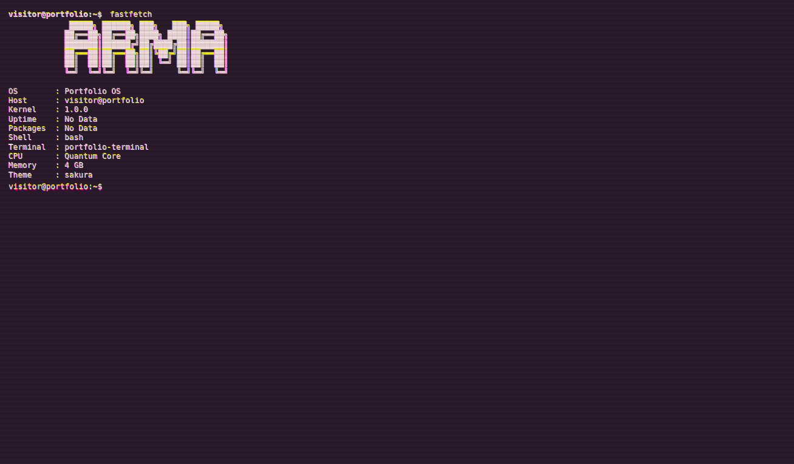
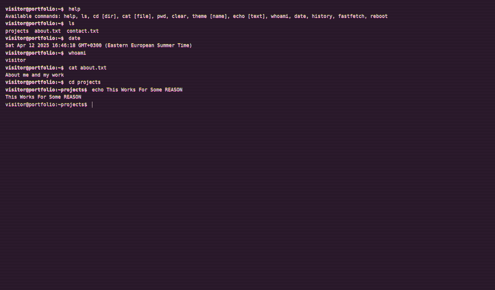

# Terminal Portfolio

A stylish, interactive terminal-based portfolio website with a retro CRT aesthetic. This project simulates a command-line interface in the browser, allowing visitors to navigate and explore content using familiar terminal commands.




## Features

- **Authentic Terminal Experience**: Simulates a real terminal with command history, autocomplete, and familiar Unix-like commands
- **File System Navigation**: Browse through a virtual file system with directories and files
- **Multiple Themes**: Choose from 5 different themes (Cyberpunk, Sakura, Summer, Dracula, Winter)
- **CRT Effects**: Retro scanlines, flicker, and glitch animations for an authentic old-school terminal feel
- **Responsive Design**: Works on desktop and mobile devices
- <del>**Smart Auto-Scroll**: Automatically scrolls to show new content with intelligent user control</del> (Work In Progress)
- **Loading Screen**: Boot-up animation simulating a system startup

## Commands

Visitors can interact with the portfolio using these commands:

- `help` - Display available commands
- `ls` - List files and directories in the current location
- `cd [dir]` - Change directory
- `cat [file]` - View file contents
- `pwd` - Show current directory path
- `clear` - Clear the terminal screen
- `theme [name]` - Change the terminal theme
- `echo [text]` - Display text
- `whoami` - Display username
- `date` - Show current date and time
- `history` - Show command history
- `fastfetch` - Display system information
- `reboot` - Restart the terminal

## Themes

- **Cyberpunk** (Default): Green text on black background
- **Sakura**: Pink text on dark purple background
- **Summer**: Gold text on dark green background
- **Dracula**: Light text on dark gray-blue background
- **Winter**: Light blue text on dark blue background

## File System Structure

The portfolio is organized into a virtual file system:

```
~/
├── about.txt       # Information about me
├── contact.txt     # Contact information
└── projects/       # Directory containing projects
    ├── projects2/  # Nested project directory
    │   ├── life/   # Another nested directory
    │   └── help.js # Help information
    └── web.js      # Web project information
```

## Auto-Scroll Feature

The terminal includes a smart auto-scroll system:

- Automatically scrolls to show new content
- Disables when user manually scrolls up
- Can be toggled with `Ctrl+S`
- Shows temporary system notifications when auto-scroll state changes
- Remembers user preference between sessions

## Technical Implementation

This project is built with vanilla JavaScript and CSS, with no external dependencies. Key components include:

- **File System**: Virtual file system with navigation capabilities
- **Command Processor**: Parses and executes terminal commands
- **Terminal UI**: Handles input/output and visual effects
- **Theme Manager**: Controls the visual appearance

## Browser Compatibility

Works in all modern browsers including:
- Chrome/Edge (Chromium-based)
- Firefox
- Safari

## Getting Started

1. Clone the repository
2. Open `index.html` in your browser
3. No build process or dependencies required!

## License

```
Copyright (c) 2025 ArmaLv

Permission is hereby granted, free of charge, to any person obtaining a copy
of this software and associated documentation files (the "Software"), to deal
in the Software without restriction, including without limitation the rights
to use, copy, modify, merge, publish, distribute, sublicense, and/or sell
copies of the Software, and to permit persons to whom the Software is
furnished to do so, subject to the following conditions:

The above copyright notice and this permission notice shall be included in all
copies or substantial portions of the Software.

THE SOFTWARE IS PROVIDED "AS IS", WITHOUT WARRANTY OF ANY KIND, EXPRESS OR
IMPLIED, INCLUDING BUT NOT LIMITED TO THE WARRANTIES OF MERCHANTABILITY,
FITNESS FOR A PARTICULAR PURPOSE AND NONINFRINGEMENT. IN NO EVENT SHALL THE
AUTHORS OR COPYRIGHT HOLDERS BE LIABLE FOR ANY CLAIM, DAMAGES OR OTHER
LIABILITY, WHETHER IN AN ACTION OF CONTRACT, TORT OR OTHERWISE, ARISING FROM,
OUT OF OR IN CONNECTION WITH THE SOFTWARE OR THE USE OR OTHER DEALINGS IN THE
SOFTWARE.
```
